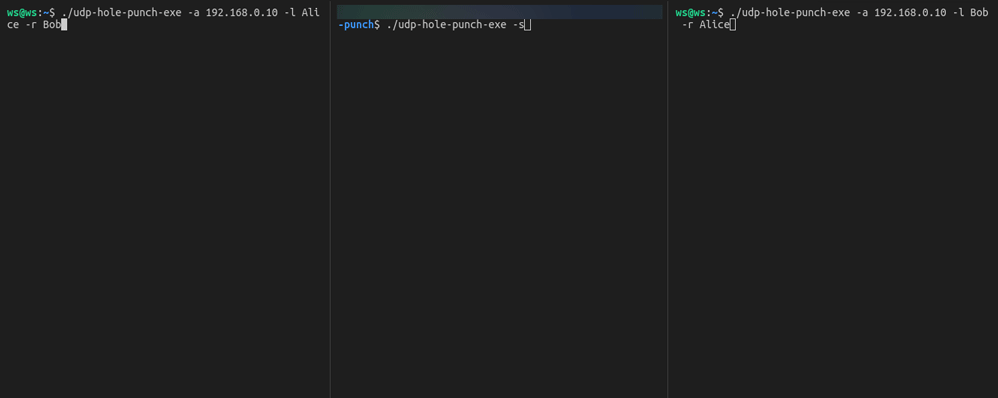

# UDP NAT hole punch

Another one UDP [NAT hole punch](http://bford.info/pub/net/p2pnat/) example implemented in GO
Establishes p2p connection beetween clients based on their IDs 

### Tested in following conditions

```
                        +----------------+
                        |                |
                        |  signal server |
                        |                |
                        +-------+--------+
                                ^ 192.168.0.10
                                |
+-------------------------------+----------------------------------+
|                                                                  |
+---------------+---------------------------------+----------------+
                ^                                 ^
                |                                 |
                | 192.168.0.11                    | 192.168.0.12
        +---------------+                +--------+-------+
        |               |                |                |
        |     NAT A     |                |     NAT B      |
        |               |                |                |
        +-------+-------+                +--------+-------+
                ^ 192.168.1.100                   ^ 192.168.2.100
                |                                 |
                |                                 |
        +-------+-------+                +--------+-------+
        |               |                |                |
        |   client A    |                |    client B    |
        |               |                |                |
        +---------------+                +----------------+
```

### Usage example

```
$ ./udp-hole-punch-exe -h
Usage of ./udp-hole-punch-exe:
  -a string
        server IP address (default "127.0.0.1")
  -l string
        local side ID (default "Alice")
  -p string
        server port (default "10001")
  -r string
        remote side ID (default "Bob")
  -s    run in server mode
  -t duration
        set reconnection timeout (default 2s)
 ```       

